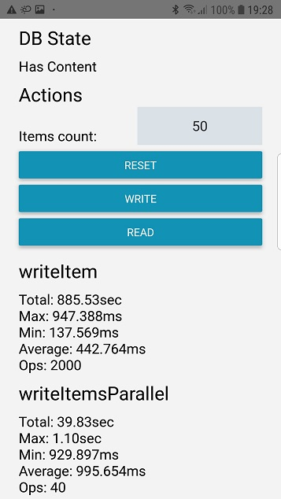

# asyncStorageBench

An app with 3 buttons used to perform read/write timings of AsyncStorage  
Focused primarily on testing the Android implementation

## Sequential tests

1. Use the `sequential-tests` branch and run the app `npm run android`
2. Set the count of items you're going to work with. 1000 items are written in about 30sec
   - for 1000 or less items debugging information is of what happens is printed on the console
   - writing to the console slows down the test and is disabled for more than 1000 items
3. Press "Write" to start the write test
4. Press "Read" to start the read test
5. Timing information would appear bellow the buttons

## Parallel tests

1. Use the `parallel-tests` branch and run the app `npm run android`
2. Set the count of items to how many parallel calls show happen at once
3. Press "Write" to start the write test
4. Press "Read" to start the read test
5. Timing information would appear bellow the buttons

## Batch tests

1. Use the `batch-tests` branch and run the app `npm run android`
2. Set the count of items to how many items should be read/written in a batch
3. Press "Write" to start the write test
4. Press "Read" to start the read test
5. Timing information would appear bellow the buttons

## Details

You can change the value returned by `bench/hooks#getPayload` to see if the value affects the tests
E.g. 
- use one of the other `kb` samples, the number after `kb` represents the size
- or provide a random number: `const getPayload = () => Math.random().toFixed(2)`
- or provide random data: `const getPayload = () => sampleData[_.random(0, sampleData.length - 1)]`
